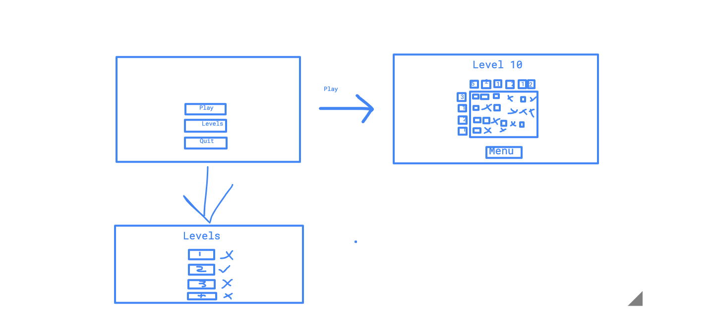

# Vaatimusmäärittely

## Sovelluksen tarkoitus

Sovelluksen tarkoitus on tuottaa iloa käyttäjälle, sekä kehittää päättelykykyä japanilaisen ristikon muodossa. Sovellusta on mahdollista käyttää offline - tilassa. Sovellus 
sisältää eri vaikeusasteisia ristikoita, jolloin eritasoisille käyttäjille löytyy kaikille haastetta.

## Käyttäjät

Sovelluksessa on ainoastaan yksi käyttäjärooli eli _pelaaja_. 

## Käyttöliittymäluonnos
Sovellus koostuu seuraavista näkymistä:
- Päävalikko (tehty)
- Tasonäkymä  (tehty)
- Taso(t)  (tehty)

 (tehty)

## Perusversion toiminnot

### Päävalikossa 

- Pelaaja voi selata eri tasoja (tehty)
- Pelaaja voi valita tasoista haluamansa tason ja pelata sitä (tehty)
- Pelaaja voi poistua pelistä (tehty)

### Pelissä

- Pelaaja voi lisätä harmaita neliöitä ruutuun, johon ei tule tummaa neliötä  (tehty)
- Pelaaja voi lisätä neliön ruutuun, johon uskoo sen kuuluvan  (tehty)
- Pelaaja voi poistua päävalikkoon, vaikka tasoa ei olisi tehty  (tehty)

## Jatkokehitysideat

Perusversion jälkeen mahdollisia lisäyksiä:

- Peliin voisi lisätä kirjaston erilaisia kuvia, joista pelaaja voisi valita, josta peli sitten luo automaattisesti tason
- Peliin voisi lisätä kirjautumis- ja rekisteröitymistoimminnon, jotta käyttäjät voivat pitää kirjaa suoritetuista tasoistaan vaikka käyttäjillä oli käytössä sama laite
- Peliin voisi lisätä **highscore** toiminnon, jolloin pelaajat voisivat vertailla omia tuloksiaan
- Peliin voisi lisätä ajastimen, jolloin se mittaisi myös kauanko pelaajalla menee aikaa tason suorittamiseen.
